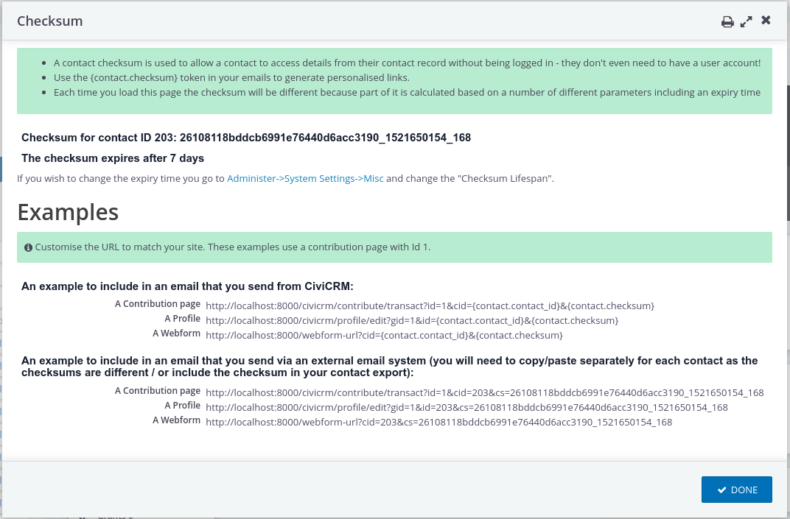
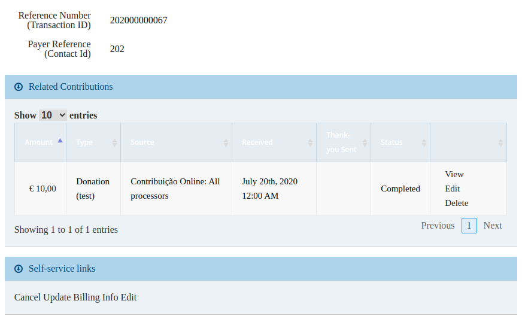

# uk.co.mjwconsult.checksum
Access to checksum functionality via API and contact record in CiviCRM.

## API functions

| Function  | Parameters | Returns |
| ------------- | ------------- | ------------- |
| ContactChecksum.generate  | id=contactId | values['checksum'] |
| ContactChecksum.validate  | id=contactId,checksum=checksum | values['checksum'] = true/false |
| ContactChecksum.gettimeoutdays | | values['days'] |

## Contact actions
A new action "Contact Checksum" loads a form with examples of how to use the checksum in emails etc:
.

## Recurring contributions

Example self-service links (for the current logged-in user) are available on the recurring contribution
detail view: 

These are the same as the links that are available in recurring receipt emails.
